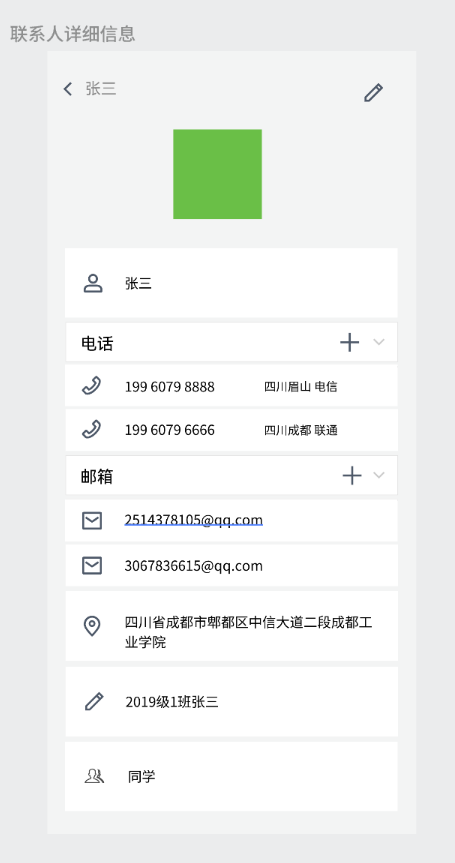
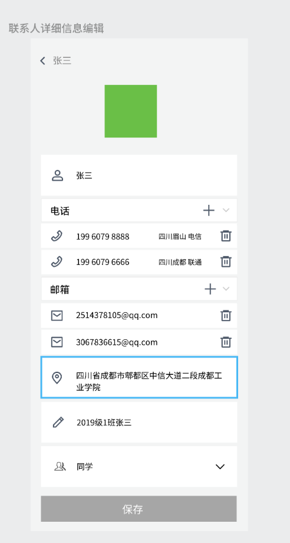
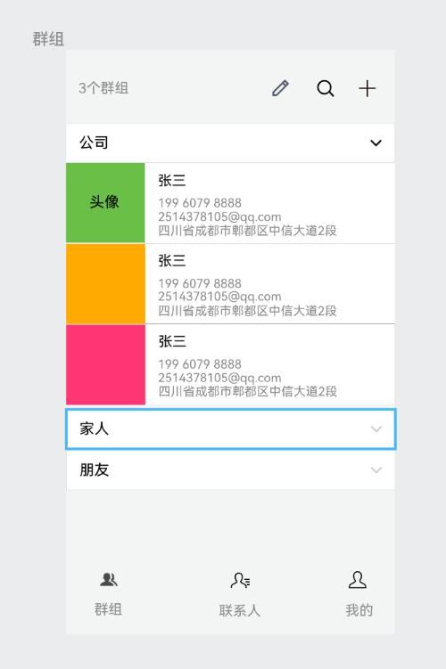
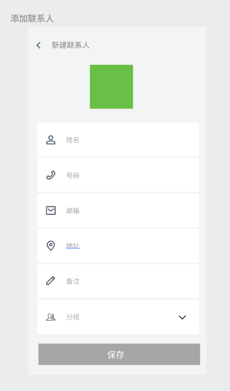
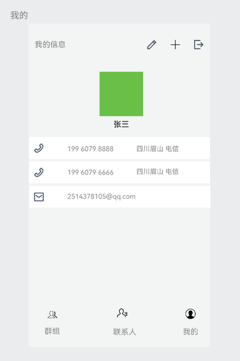

# 联系人管理系统-HTML5移动端

 

## 功能

- 添加、删除、编辑联系人：允许用户手动输入联系人信息（如姓名、电话号码、地址和电子邮箱），并将此信息保存在系统中，可以在删除已存在的联系人，并可以修改联系人信息（如姓名、电话号码、地址和电子邮箱）。
- 联系人分组管理：允许用户手动创建、编辑、删除联系人分组，并可以将联系人分配到不同的分组中。
- 权限管理：在多用户环境中，系统还应该具有合适的权限控制功能，以确保与访问和管理联系人及联系人分组相关的操作只能由有相应权限的用户执行。
- 数据可视化：对于联系人信息和联系人分组信息进行可视化展示，例如图表展示联系人分布情况、每个分组中包含的联系人数量和所占比例等等。
- 批量操作：允许用户同时添加、删除和编辑多个联系人和分组，以帮助用户更高效地管理和使用联系人和联系人分组，例如批量移动联系人到另一个分组中。

## 数据库

- 用户表-user
  - id bigint 关键字
  - username varchar 唯一
  - password varchar
  - contact_id bigint 外键
  - is_deleted tinyint
- 分组表-group
  - id bigint 关键字
  - name varchar
  - user_id bigint 外键
  - is_deleted tinyint
- 联系人表-contact
  - id bigint 关键字
  - name varchar
  - address varchar
  - remark varchar
  - user_id bigint 外键
  - group_id bigint 外键
  - is_deleted tinyint
- 邮箱表-mail
  - id bigint 关键字
  - value varchar
  - contact_id bigint 外键
  - is_deleted tinyint
- 电话表-phone
  - id bigint 关键字
  - value char
  - source varchar
  - contact_id biginit 外键
  - is_deleted tinyint

## 后端接口

- 用户模块

  - 注册：`http://ip:8089/api/v1/pri/user/register`

    - 请求方式：POST

    - 请求参数：请求体，JSON格式

    - 响应：无特殊信息

      ```json
      {
          "username": "xxxx",
          "password": "xxxx"
      }
      ```

      

  - 登录：`http://ip:8089/api/v1/pri/user/login`

    - 请求方式：POST

    - 请求参数：请求体，JSON格式

    - 响应：字符串令牌

      ```json
      {
          "username": "xxxx",
          "password": "xxxx"
      }
      ```

      

  - 用户详细信息：`http://ip:8089/api/v1/pri/user`

    - 请求方式：GET
    - 请求参数：请求头`token`带上登录返回的令牌
    - 响应：用户信息
    
  - 更新用户基本信息：`http://ip:8089/api/v1/pri/user/base`
  
    - 请求方式：PUT
  
    - 请求参数：
  
      - 请求头`token`带上令牌
  
      - 需要更改的数据
  
        ```json
        {
            "name":"xxx",
            "address": "xxx"
        }
        ```
  
        
  
    - 响应：无特殊响应
  
  - 注销用户
  
- 联系人模块

  - 添加联系人：`http://ip:8089/api/v1/pri/contact`
    - POST
    - 需要令牌
    - 无特殊响应

  - 修改联系人
  - 删除联系人
  - 获取所有联系人
  - 查看某个联系人的详细信息

- 群组模块

  - 添加群组
  - 修改群组
  - 删除群组
  - 获取所有群组及联系人


## 页面










