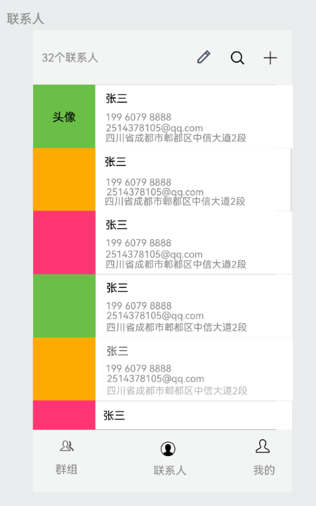

# 联系人管理系统-HTML5移动端

 

## 功能

- 添加、删除、编辑联系人：允许用户手动输入联系人信息（如姓名、电话号码、地址和电子邮箱），并将此信息保存在系统中，可以在删除已存在的联系人，并可以修改联系人信息（如姓名、电话号码、地址和电子邮箱）。
- 联系人分组管理：允许用户手动创建、编辑、删除联系人分组，并可以将联系人分配到不同的分组中。
- 权限管理：在多用户环境中，系统还应该具有合适的权限控制功能，以确保与访问和管理联系人及联系人分组相关的操作只能由有相应权限的用户执行。
- 数据可视化：对于联系人信息和联系人分组信息进行可视化展示，例如图表展示联系人分布情况、每个分组中包含的联系人数量和所占比例等等。
- 批量操作：允许用户同时添加、删除和编辑多个联系人和分组，以帮助用户更高效地管理和使用联系人和联系人分组，例如批量移动联系人到另一个分组中。

## 数据库

```sql
# 删除存在的表
DROP TABLE IF EXISTS phone;
DROP TABLE IF EXISTS mail;
DROP TABLE IF EXISTS contact;
DROP TABLE IF EXISTS `group`;
DROP TABLE IF EXISTS `user`;


# 创建表
CREATE TABLE `user` (
	id CHAR(32) PRIMARY KEY COMMENT '关键字',
	username VARCHAR(50) UNIQUE COMMENT '用户名',
	`password` VARCHAR(50) COMMENT '登录密码',
	contact_id CHAR(32) COMMENT '外键，关联联系人，表示自己的信息',
	is_deleted TINYINT(1) DEFAULT 0 COMMENT '逻辑删除'
) COMMENT = '用户表';

CREATE TABLE `group` (
	id CHAR(32) PRIMARY KEY COMMENT '关键字',
	`name` VARCHAR(50) COMMENT '组名',
	user_id CHAR(32) NOT NULL COMMENT '外键，关联用户',
	is_deleted TINYINT(1) DEFAULT 0 COMMENT '逻辑删除',
	FOREIGN KEY (user_id) REFERENCES `user`(id)
) COMMENT = '分组表';

CREATE TABLE contact (
	id CHAR(32) PRIMARY KEY COMMENT '关键字',
	`name` VARCHAR(50) COMMENT '联系人姓名',
	head VARCHAR(255) COMMENT '头像',
	address VARCHAR(50) COMMENT '联系人居住地址',
	remark VARCHAR(255) COMMENT '联系人备注',
	user_id CHAR(32) COMMENT '外键，关联用户',
	group_id CHAR(32) COMMENT '外键，关联分组',
	is_deleted TINYINT(1) DEFAULT 0 COMMENT '逻辑删除',
	FOREIGN KEY (user_id) REFERENCES `user`(id),
	FOREIGN KEY (group_id) REFERENCES `group`(id)
) COMMENT = '联系人表';

CREATE TABLE mail (
	id CHAR(32) PRIMARY KEY COMMENT '关键字',
	`value` VARCHAR(255) NOT NULL COMMENT '邮箱地址',
	contact_id CHAR(32) NOT NULL COMMENT '外键，关联联系人',
	is_deleted TINYINT(1) DEFAULT 0 COMMENT '逻辑删除',
	FOREIGN KEY (contact_id) REFERENCES contact(id)
) COMMENT = '邮箱表';

CREATE TABLE phone (
	id CHAR(32) PRIMARY KEY COMMENT '关键字',
	`value` VARCHAR(50) NOT NULL COMMENT '电话号码',
	source VARCHAR(50) COMMENT '号码归属地',
	contact_id CHAR(32) NOT NULL COMMENT '外键，关联联系人',
	is_deleted TINYINT(1) DEFAULT 0 COMMENT '逻辑删除',
	FOREIGN KEY (contact_id) REFERENCES contact(id)
) COMMENT = '电话表';

# 为用户表关联外键
ALTER TABLE `user`
ADD CONSTRAINT fk_user_contact
FOREIGN KEY (contact_id)
REFERENCES contact(id);
```


## 后端接口

- 用户模块

  - 注册：`http://ip:8089/api/v1/pri/user/register`

    - 请求方式：POST

    - 请求参数：请求体，JSON格式

    - 响应：无特殊信息

      ```json
      {
          "username": "xxxx",
          "password": "xxxx"
      }
      ```

      

  - 登录：`http://ip:8089/api/v1/pri/user/login`

    - 请求方式：POST

    - 请求参数：请求体，JSON格式

    - 响应：字符串令牌

      ```json
      {
          "username": "xxxx",
          "password": "xxxx"
      }
      ```

      

  - 用户详细信息：`http://ip:8089/api/v1/pri/user`

    - 请求方式：GET
    - 请求参数：请求头`token`带上登录返回的令牌
    - 响应：用户信息
    
  - 更新用户基本信息：`http://ip:8089/api/v1/pri/user/base`
  
    - 请求方式：PUT
  
    - 请求参数：
  
      - 请求头`token`带上令牌
  
      - 需要更改的数据
  
        ```json
        {
            "name":"xxx",
            "address": "xxx"
        }
        ```
  
        
  
    - 响应：无特殊响应
  
  - 添加手机号：`http://ip:8089/api/v1/pri/user/phone`
  
    - POST
  
    - token
  
      ```json
      {
          "value": "xxxxx"
      }
      ```
  
      
  
    - 无特殊返回
  
  - 添加邮箱
  
    - POST：`http://ip:8089/api/v1/pri/user/mail`
  
    - token
  
      ```json
      {
          "value": "xxxx"
      }
      ```
  
      
  
    - 无特殊返回
  
  - 注销用户
  
- 联系人模块

  - 添加联系人：`http://ip:8089/api/v1/pri/contact`

    - POST

    - 需要令牌

      ```json
      {
          "contact": {
              "name": "李四",
              "address": "成都工业学院郫都校区",
              "remark": "同班同学"
          },
          "phones": [
              {
                  "value": "19960791111"
              },
              {
                  "value": "19960792222"
              }
          ],
          "mails": [
              {
                  "value": "2514378105@qq.com"
              },
              {
                  "value": "3067836615@qq.com"
              }
          ]
      }
      ```

      

    - 无特殊响应

  - 修改联系人

  - 删除联系人

  - 获取所有联系人：`http://ip:8089/api/v1/pri/contact`

    - GET
    - 需要令牌
    - 返回所有联系人信息

  - 查看某个联系人的详细信息：`http://ip:8089/api/v1/pri/contact/xxxx`

    - GET
    - 需要令牌，并且地址栏需要附上查询联系人的id号
    - 返回联系人详细信息

  - 获取某个群组下的联系人列表：`http://ip:8089/api/v1/pri/contact/group/xxxx`

    - GET
    - 需要令牌，地址栏需要组ID号
    - 返回对应组联系人列表

- 群组模块

  - 添加群组：`http://ip:8089/api/v1/pri/group`

    - POST

    - 需要令牌，添加群组的数据

      ```json
      {
          "name": "同学"
      }
      ```

      

    - 无特殊返回

  - 将联系人添加到群组：`http://ip:8089/api/v1/pri/group/xxxx/xxxx`

    - PUT
    - 需要令牌，地址栏需要两个参数，分别为组ID与联系人ID
    - 无特殊返回

  - 修改群组

  - 删除群组：`http://ip:8089/api/v1/pri/group/xxxx`

    - DELETE
    - 需要令牌，地址栏需要群组ID
    - 无特殊返回

  - 获取所有群组：`http://ip:8089/api/v1/pri/group`

    - GET
    - 需要令牌
    - 群组列表


## 页面





